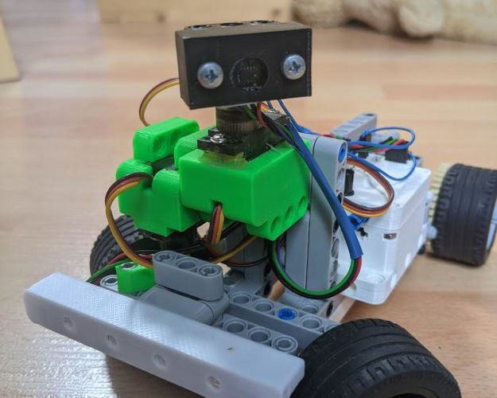

# micropython_legorobots

This repository is for the documentation of my LEGO compatible robot platform based 
on the esp32 and a 3D printed housing. Here are some videos of robots in action: https://www.youtube.com/playlist?list=PL1qkIXs3HI0etdAwmriiLkkrndSfr02LH
Find more information here: https://makeprojects.com/project/brick-bots

## hardware
### pinout

### components
* esp32 board: TTGO MINI 32 V2.0 ESP32 WiFi Bluetooth Module development board
* motor driver: wemos d1mini motor shield 
    * firmware from https://github.com/pbugalski/wemos_motor_shield
    * i2c
* battery: 1200mAh 3.7V Li ion for small rc quadcopter (903052)
* motors: Mabuchi FF 180 FH
    * https://www.pollin.de/productdownloads/D310419D.PDF
    * official ratings:
        * voltage: 2,4 V- (1...3 V-)
        * current free/load: 130/700 mA
        * nominal power: 1,06 W
        * speed free/ load: 7700/6500 U/min
        * nominal/max torque: 1,56/10,0 mNm
    * driven from the battery (at max 4.2 V)
* motors: Noname geared hall effect encoder motors, advertised as 5V (but I have doubts)
* servo: mg90 metal gear
    * hobby servo pwm control at 50Hz (also works with other frequency)
    * torque: 2.5kgcm (~250mNm)
    * drops out if battery voltage gets lower (3.XV?)
* mpu 6050 Six-Axis (Gyro + Accelerometer)
    * i2c
    * speed: 250/sec to 2000/sec (see data sheet)
* range sensor vl53l0x
    * laser time of flight
    * i2c
    * maximum distance: 1300 mm
* neopixel
    * either one led directly on the box or 4 leds in a legobar

### Planed components:
* Camera module based on AI thinker esp32 cam (running its own firmware)
* ir module?
* ultrasonic sensor module (mainly as they look so nice like eyes) and have slightly larger range.

## micropython
esp32 firmware from loboris: https://github.com/loboris/MicroPython_ESP32_psRAM_LoBo
The functionality and syntax of the modules differs from the official micropython ports. 
There is a good documentation in the wiki of the github page:

## 3D printing:
.stl and freecad files are available on Thingiverse: https://www.thingiverse.com/thing:3710047

## robots:
The robots subfolder contains micropython code for different models

### function_test:
Tests and example code for the different sensors, servos, and motors. 

### autonomous_car:
simple obstical avoidance
* uses one motor, servo for steering, vl53l0x range finder, neopixel bar (optionally)

### self_balancing_robot:
* uses geared encoder motors, a IMU sensor, and PID algorithm to balance. At least in theory, its not working so far. 
